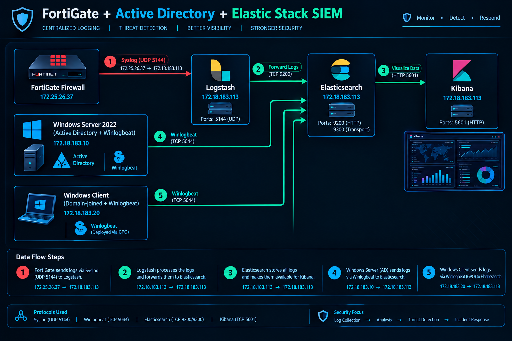

# FortiGate + Active Directory SIEM with Elastic Stack

Multi-source SIEM built from scratch in a virtualized lab: FortiGate firewall logs and Windows Active Directory events normalized to ECS, indexed in Elasticsearch, and visualized in Kibana dashboards.

## Architecture

FortiGate VM64 (172.18.178.220)
| syslog UDP 5144
v
Logstash -- grok, kv, ECS mapping, geoip
|
v
Elasticsearch 8.19.21 (Ubuntu 172.18.183.113)
^
| Winlogbeat 8.19.21 + ingest pipelines
|
Windows Server 2022 DC (test.local) + Windows Client (GPO-deployed)
|
v
Kibana 5601


## Stack

| Component | Version / Detail |
|---|---|
| FortiGate | VM64 v7.0.5 build0304 |
| Elasticsearch | 8.19.21 (single node) |
| Kibana | 8.19.21 |
| Logstash | 8.19.21 |
| Winlogbeat | 8.19.21 |
| Windows Server | 2022 (Domain Controller) |
| Host OS | Ubuntu 24.04 |

## Data volume

- Windows/AD: 20,000+ events, 73% ECS-categorized
- FortiGate: 112,000+ events including a full port scan capture
- Categories observed: authentication, iam, configuration, process, driver, network

## Dashboards

### Windows / Active Directory
1. Events Over Time by Category (area, stacked)
2. Events by Category (bar)
3. Top Security Actions (table, 15 rows)
4. Total Events (metric)
5. Failed Logon Attempts (metric, `event.code: 4625`)
6. Top Users in Events (bar, machine accounts excluded)

### FortiGate
1. Total Firewall Events (metric)
2. Denied Connections (metric, `action: deny`)
3. Firewall Activity Over Time (line, breakdown by action)
4. Top Source IPs (horizontal bar)
5. Top Targeted Ports (table, denied only)
6. Unique Ports Scanned (metric, unique count of `destination.port`)

## Detection validation

Ran a full TCP SYN scan against the firewall to verify end-to-end pipeline function:

```bash
sudo nmap -sS -p- 172.18.178.220
```

Result in Elasticsearch:

| Metric | Value |
|---|---|
| Total events generated | ~45,700 in 142 seconds |
| `action: deny` | 45,355 (99%) |
| Unique source IPs | 1 |
| Unique destination ports | ~45,000 |
| Docs per port | 2 (SYN + retry) |

Textbook port scan signature: single source, tens of thousands of distinct ports, near-total deny rate.

**Security finding:** the scan revealed telnet (port 23) exposed on the firewall management interface. Remediated:

config system interface
edit port1
unset allowaccess
set allowaccess ping https ssh
next
end


## Key lessons

### Index mapping must be defined before the first document
Elasticsearch infers mappings from the first document it receives. Without a template in place, fields land as `text` and aggregations fail permanently:

Fielddata is disabled on [source.ip]. Text fields are not optimised
for operations that require per-document field data like aggregations


An existing index cannot be remapped. Recovery required routing to a new pattern (`fortigate-v2-*`) with an explicit template at `priority: 600`.

### The `type` field collides with FortiGate's own schema
FortiGate uses `type` natively (`traffic`, `event`, `utm`). Setting `type => "fortigate"` on the Logstash input means `kv` overwrites it, silently breaking every downstream `if [type] == ...` conditional. Use `tags => ["fortigate"]` instead.

### Time synchronization is a correctness prerequisite, not an optimization
The FortiGate clock ran 2.5 hours ahead. The Logstash `date` filter was correct and the mapping was correct, yet every timestamp landed in the future — relative time ranges in Kibana returned nothing, and cross-source correlation between firewall and AD events would have been impossible.

Compounding issue: FortiOS 7.0.5 treats Cairo as GMT+2, but Egypt observes GMT+3 (EEST) since DST returned in 2023. The OS timezone database predates the change, so no manual clock setting survives an NTP sync.

Robust fix — parse the vendor's absolute epoch field instead of the formatted local time:

```ruby
if [eventtime] {
  ruby {
    code => "
      et = event.get('eventtime').to_s
      event.set('event_epoch_ms', (et[0,13]).to_i) if et.length >= 13
    "
  }
  date {
    match => [ "event_epoch_ms", "UNIX_MS" ]
    target => "@timestamp"
    remove_field => [ "event_epoch_ms", "eventtime", "date", "time", "tz" ]
  }
}
```

`eventtime` is epoch nanoseconds in absolute UTC — immune to timezone config, DST rules, and display settings.

### Winlogbeat only categorizes channels it has ECS mappings for
The routing pipeline branches on four channels: Security, Sysmon, Windows PowerShell, and PowerShell/Operational. Events from System and Application pass through without `event.category` — 27% of collected events in this lab. Not a bug; a design constraint worth knowing before building category-based visualizations.

### `user.name` is not always the actor
Winlogbeat copies `user.name` from either `SubjectUserName` (the actor) or `TargetUserName` (the object of the action), depending on event code. Event 4738 (user account modified) surfaced `ANONYMOUS LOGON` in `user.name` — a field value, not an actual anonymous logon. Use `user.name` for the actor and `user.target.name` for the target.

### Single-node clusters default to yellow health
Replica shards have nowhere to allocate. Fixed via component template so new indices inherit it:

```json
PUT _component_template/winlogbeat-single-node
{ "template": { "settings": { "index.number_of_replicas": 0 } } }
```

## Repository contents

configs/
fortigate.conf Logstash pipeline (credentials redacted)
winlogbeat.yml Winlogbeat config
index-templates.json Elasticsearch index templates
setup/
01-elasticsearch.md
02-logstash.md
03-winlogbeat-gpo.md
04-fortigate-syslog.md
dashboards/
windows-ad.ndjson Exported Kibana saved objects
fortigate.ndjson
screenshots/


## Notes

Credentials in this repository are placeholders. Lab IP addresses are RFC 1918 private ranges from an isolated environment.
